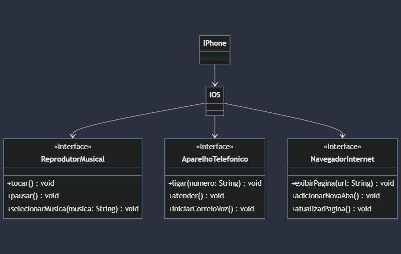

# POO - Desafio DIO

### Modelagem e Diagramação de um Componente iPhone

### Objetivo
1. Criar um diagrama UML que represente as funcionalidades descritas.

2. Implementar as classes e interfaces correspondentes em Java (Opcional).
### Diagrama UML do projeto

### Implementando classe e interface 
Foi criado as três interfaces para cada função do aparelho e a classe IOS para receber as funções e poder ser reaproveitada em outros aparelhos.Todas sendo divididas em seus respectivos pacotes.
